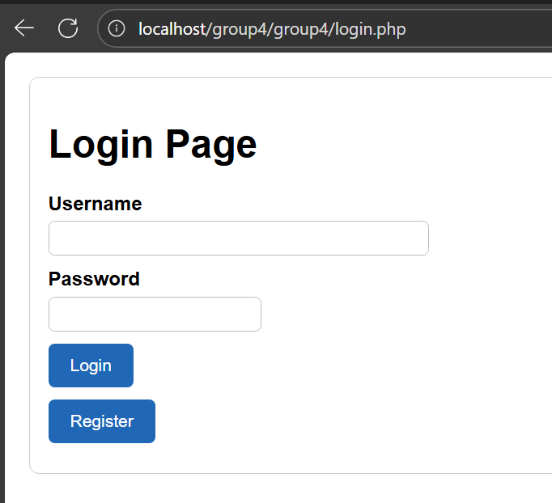

# User Authentication

A red text trigger if we have invalid input with each empty box

A red text trigger if password or username is incorrect

# XAMPP, SQL Database
Using XAMPP to store all important data collections

db.sql file:

# Pages

### Admin Dashboard

For the header, a table of Staff Info and a filer box for Machine

A list of Machine

Make a filter with "3D Printer" with "Idle" status

### Manager Dashboard
For the most part, the structure of other dashboard is the same as Manager Dashboard with Todo Jobs:

### Todo Page for each role

Manager Todo Job

Auditor Todo Job

Operator Todo Job

### Update Staff Info

Go to "Manage Users" to make update staff info

As we can see, we can "Delete" staff or "Update" their info

A successful nofitication after we updated staff info

Before we completely delete staff, make sure that a notification trigger to confirm

